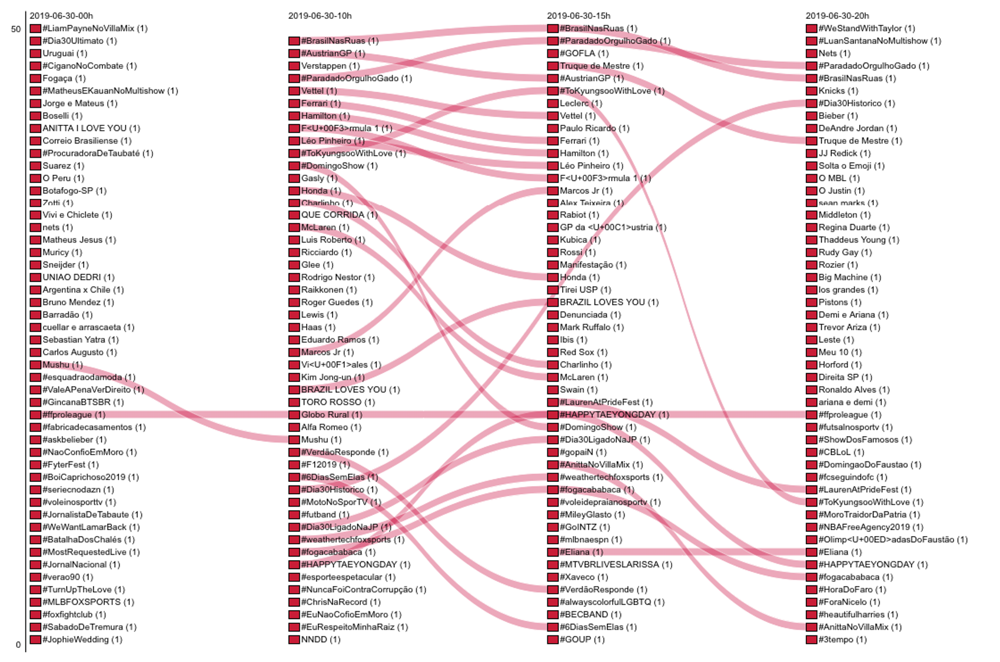
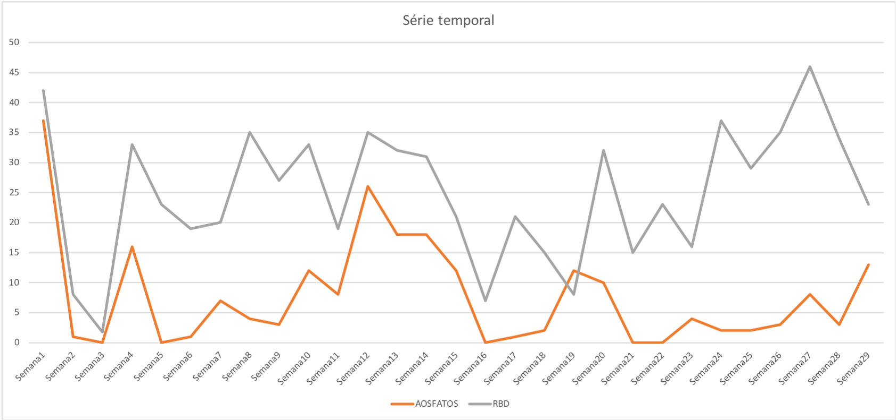
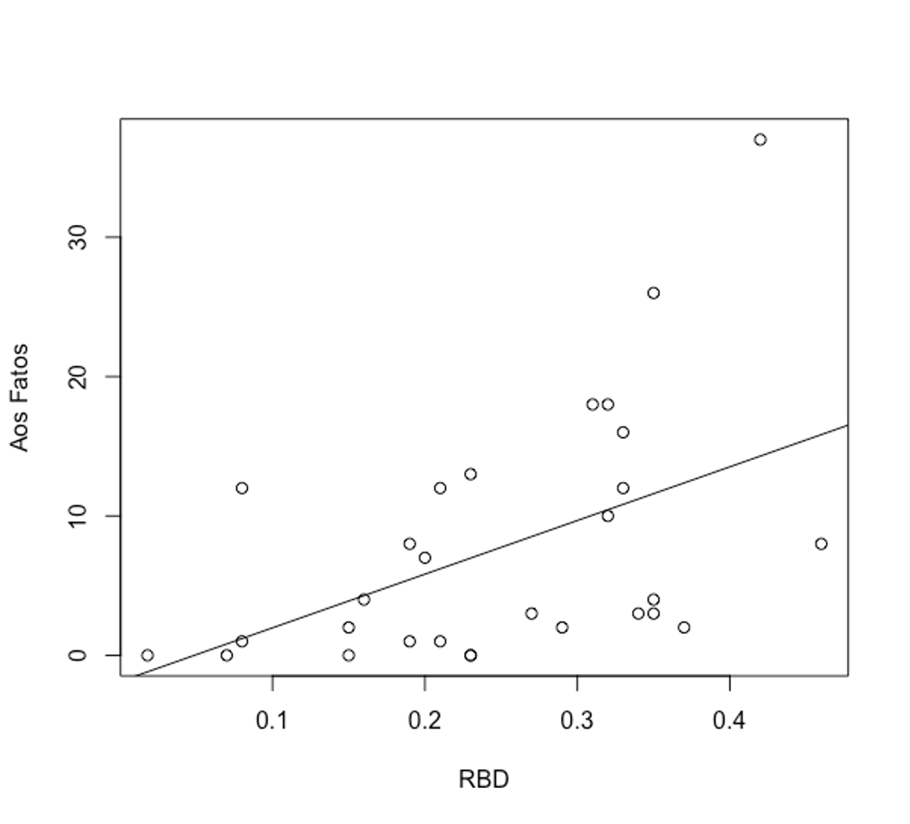

# data_rankflowsOP

### O que está acontecendo? O que os trending topics podem nos dizer a respeito de ações políticas coletivamente orquestradas

### What's happening? What trending topics can tell us about collectively orchestrated political action

### ¿Qué está pasando? Qué pueden decirnos los trending topics sobre la acción política orquestada colectivamente

### Que ce passe-t-il? Ce que les sujets d'actualité peuvent nous dire sur l'action politique orchestrée collectivement

Este repositório apresenta as imagens e gráficos plotados a partir dos dados trabalhados no artigo "O que está acontecendo? O que os trending topics podem nos dizer a respeito de ações políticas coletivamente orquestradas". Os dados brutos estão disponíveis mediante consulta aos pesquisadores.

**Quadro 1 – Análise de fluxos de ranqueamento** (Clique para ampliar)

*Rankflow dos trending topics de 30/06*

*Rankflow dos trending topics de 10 e 11/06* (Clique para ampliar)

**Quadro 4 – Comparação de séries temporais de declarações de Bolsonaro e oscilações nos trending topics**

**Quadro 5 – Diagrama de dispersão Aos Fatos versus RBD com reta ajustada**

